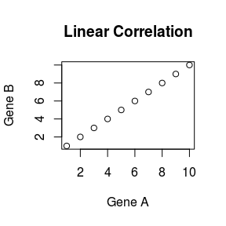
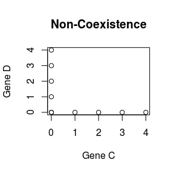
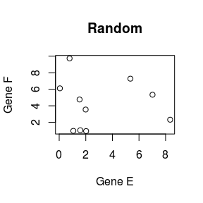
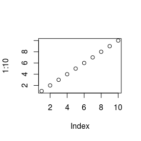
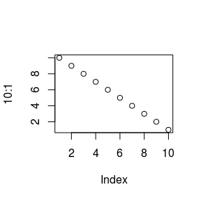

# Prerequisites

The `mage` package has been designed to capture but foremost to classify any significant association 
between the expression of 2 genes in a single cell rna sequencing dataset.

## What is an association between 2 genes?

The best way to figure yourself out what an association between 2 genes really means would be probably to 
visualize it as a scatterplot with the x and y axis corresponding to the expression of two genes (say A and B),
and in which each point would represent a cell. 

As a matter of example, let us produce three scatterplots:

- a linear correlation
- a non-coexistence relationship
- a random relationship


```r
plot(1:10, xlab = "Gene A", ylab = "Gene B", main = "Linear Correlation");
plot(c(0:4, rep(0,5)), c(rep(0,5), 0:4), xlab = "Gene C", ylab = "Gene D", main = "Non-Coexistence");
plot(runif(10, 0, 10), runif(10, 0, 10), xlab = "Gene E", ylab = "Gene F", main = "Random");
```



Intuitevely, we can quickly see that the two first scatterplots result from a meaningful relationship 
between 2 genes while the third one depict a weaker association.

By "significantly associated", we therefore mean that 2 genes exhibit a relationship which is "remarkable" 
and clearly distinguishable from noise. 

## What is the output of mage?

# Tutorial Presentation

This tutorial provides a quick overview of the different features this package can offer. 
It shows how to compute the strength of the associations of each unique pair of gene from a gene 
expression matrix, how to characterize them and more essentially how to make the most of the variety 
of the `mage` functions to cluster the significant associations based on the type of their 
relationships *(i.e linear correlation, non-coexistence, sinusoids ...)*

In a near future, this tutorial will include a series of post-hoc analyses to explain how the standard
output from mage can be used to extract meaningful informations from a biological point of view ...

# Setup


Vignettes are long form documentation commonly included in packages. Because they are part of the distribution of the package, they need to be as compact as possible. The `html_vignette` output type provides a custom style sheet (and tweaks some options) to ensure that the resulting html is as small as possible. The `html_vignette` format:

- Never uses retina figures
- Has a smaller default figure size
- Uses a custom CSS stylesheet instead of the default Twitter Bootstrap style

## Vignette Info

Note the various macros within the `vignette` section of the metadata block above. These are required in order to instruct R how to build the vignette. Note that you should change the `title` field and the `\VignetteIndexEntry` to match the title of your vignette.

## Styles

The `html_vignette` template includes a basic CSS theme. To override this theme you can specify your own CSS in the document metadata as follows:

    output: 
      rmarkdown::html_vignette:
        css: mystyles.css

## Figures

The figure sizes have been customised so that you can easily put two images side-by-side. 


```r
plot(1:10)
plot(10:1)
```



You can enable figure captions by `fig_caption: yes` in YAML:

    output:
      rmarkdown::html_vignette:
        fig_caption: yes

Then you can use the chunk option `fig.cap = "Your figure caption."` in **knitr**.

## More Examples

You can write math expressions, e.g. $Y = X\beta + \epsilon$, footnotes^[A footnote here.], and tables, e.g. using `knitr::kable()`.


                      mpg   cyl    disp    hp   drat      wt    qsec   vs   am   gear   carb
------------------  -----  ----  ------  ----  -----  ------  ------  ---  ---  -----  -----
Mazda RX4            21.0     6   160.0   110   3.90   2.620   16.46    0    1      4      4
Mazda RX4 Wag        21.0     6   160.0   110   3.90   2.875   17.02    0    1      4      4
Datsun 710           22.8     4   108.0    93   3.85   2.320   18.61    1    1      4      1
Hornet 4 Drive       21.4     6   258.0   110   3.08   3.215   19.44    1    0      3      1
Hornet Sportabout    18.7     8   360.0   175   3.15   3.440   17.02    0    0      3      2
Valiant              18.1     6   225.0   105   2.76   3.460   20.22    1    0      3      1
Duster 360           14.3     8   360.0   245   3.21   3.570   15.84    0    0      3      4
Merc 240D            24.4     4   146.7    62   3.69   3.190   20.00    1    0      4      2
Merc 230             22.8     4   140.8    95   3.92   3.150   22.90    1    0      4      2
Merc 280             19.2     6   167.6   123   3.92   3.440   18.30    1    0      4      4

Also a quote using `>`:

> "He who gives up [code] safety for [code] speed deserves neither."
([via](https://twitter.com/hadleywickham/status/504368538874703872))
